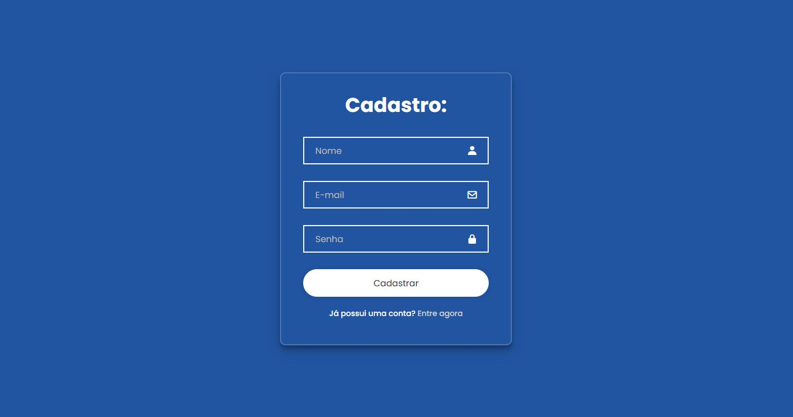

# Sistema de Login Simples

## Descrição

💻 Sistema de Login Simples

Este projeto foi desenvolvido como parte de um exercício do curso da Proz Educação
, com o objetivo de reforçar os conceitos de CRUD em PHP e uso de formulários com integração ao MySQL.

Além do que foi proposto no exercício, tomei a iniciativa de criar uma interface mais amigável utilizando CSS, já que o projeto original estava visualmente básico.


## 🚀 Tecnologias Utilizadas

 – para a lógica do servidor e operações CRUD.

 – para o armazenamento e gerenciamento dos dados de login.

 – estruturação das páginas.

 – estilização e melhorias visuais da interface.

## 📌 Funcionalidades

• Cadastro de usuários

• Login com verificação de credenciais

• Listagem de usuários cadastrados (CRUD)

• Atualização e exclusão de usuários

• Interface simples e estilizada

## 🛠 Como rodar o projeto

1. Clone este repositório:
````bash 
    git clone git@github.com:joaovrf13/Sistema-de-Login-Simples.git
````
##
2. Importe o banco de dados:

    •No seu MySQL (via phpMyAdmin ou outro), importe o arquivo banco.sql.

    •Ou crie uma tabela com os campos básicos: id, usuario, senha.
##
3. Configure a conexão com o banco:

    Verifique as credenciais do banco no arquivo de conexão PHP (geralmente conexao.php).

##
4. Execute o projeto:

    Coloque os arquivos em um servidor local (ex: XAMPP, WAMP ou Laragon).

    Acesse http://localhost/nome-da-pasta no navegador.

## ✨ Extras

• Interface criada com foco em simplicidade e clareza

• Código organizado para fácil manutenção e aprendizado

## 📚 Aprendizados

Este exercício ajudou a reforçar:

Manipulação de dados com MySQL via PHP

Lógica de autenticação

Integração frontend/backend

Organização de um projeto web completo

## 📷 Imagens



